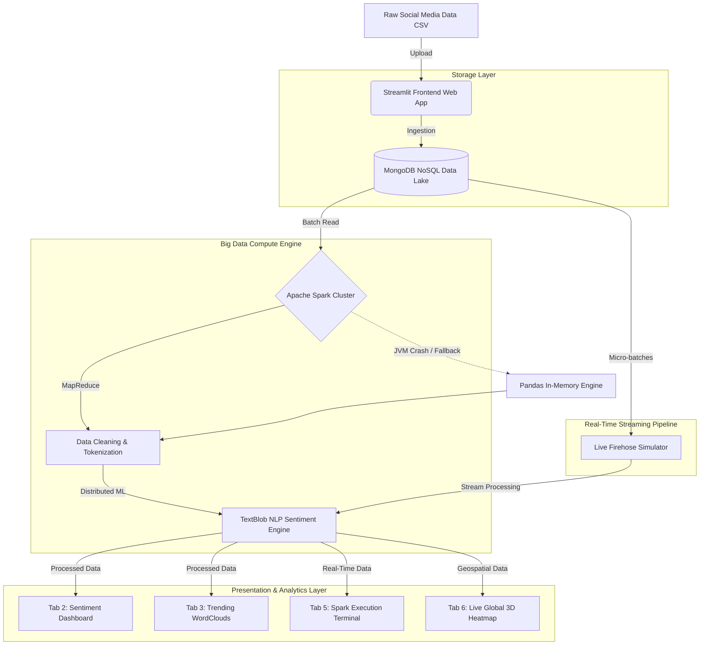

# 📈 Big Data Social Media Sentiment & Trend Analyzer

An enterprise-grade, distributed analytics platform designed to ingest, process, and visualize massive volumes of unstructured social media data. Built with **Apache Spark**, **MongoDB**, and **Streamlit**, this dashboard acts as a live command center to identify public sentiment, extract trending topics, and map global engagement in real-time.

---

## 🚀 Features

- **Automated Data Lake Ingestion**: Upload raw CSV data and route it directly into a MongoDB NoSQL database.
- **Distributed Big Data Processing**: Uses Apache Spark (PySpark) with MapReduce concepts to rapidly process text and perform sentiment analysis across multiple cores.
- **Fault-Tolerant Engine**: Implements graceful degradation—if the local Java/Spark bridge fails, the system instantly falls back to an in-memory Pandas engine without breaking the UI.
- **Live Stream Firehose**: Simulates real-time Big Data velocity by streaming micro-batches of data into the dashboard while printing live Spark execution logs.
- **Interactive Global 3D Heatmap**: A live-updating geospatial Plotly map that visualizes the exact origin of positive and negative social media sentiment across major global tech hubs.
- **Machine Learning NLP**: Utilizes TextBlob and custom tokenization to perform polarity scoring and extract trending keywords.

---

## 🛠️ Technology Stack

- **Frontend & Visualization:** Streamlit, Plotly Express, Matplotlib, WordCloud
- **Compute Engine:** Apache Spark (PySpark), Pandas
- **Storage:** MongoDB, PyMongo
- **NLP & ML:** TextBlob, Regex

---

## 🧠 System Architecture



---

## ⚙️ Installation & Setup

### 1. Prerequisites
- Python 3.9+
- [MongoDB Community Server](https://www.mongodb.com/try/download/community) installed and running locally on port `27017`
- Java 8+ (required for Apache Spark)

### 2. Clone the Repository
```bash
git clone https://github.com/yourusername/Social-Media-Big-Data-Analyzer.git
cd Social-Media-Big-Data-Analyzer
```

### 3. Install Dependencies
```bash
pip install -r requirements.txt
```

### 4. Run the Application
```bash
streamlit run app.py
```
*The app will automatically open in your browser at `http://localhost:8502`.*

---

## 💻 Usage Guide
1. **Upload Data:** Go to **Tab 1** and upload the `sample_dataset.csv`. Click process.
2. **View Analytics:** Navigate through Tabs 2-4 to see static sentiment distributions, trending word clouds, and targeted search results.
3. **Live Simulation:** Open **Tab 5** to watch the simulated Spark data stream logs.
4. **Global Map:** Open **Tab 6** and start the live stream to watch sentiment points populate a 3D globe in real-time.

---
*Built as a comprehensive Big Data & Cloud Computing demonstration project.*
